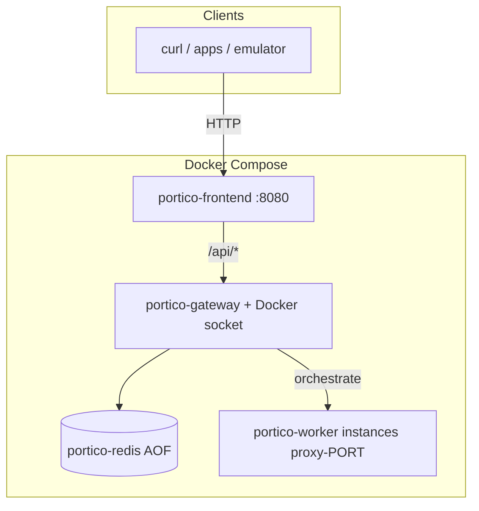

# Portico

**Multi-location OpenVPN HTTP proxy gateway** — Docker Compose stack with a web control plane, Redis-backed assignment state, and on-demand per-port VPN workers.

| | |
|---|---|
| **Repository** | [github.com/cipher-x-sudo/portico-proxy](https://github.com/cipher-x-sudo/portico-proxy) |
| **Deployment** | Docker Compose (Linux, Windows Docker Desktop, macOS Docker Desktop) |
| **License** | Add a `LICENSE` to your fork when redistributing; this README does not grant rights beyond upstream components. |

---

## Table of contents

- [Portico](#portico)
  - [Table of contents](#table-of-contents)
  - [Overview](#overview)
  - [Architecture](#architecture)
  - [Requirements](#requirements)
    - [Linux host: install Docker (Debian / Ubuntu)](#linux-host-install-docker-debian--ubuntu)
  - [Repository layout](#repository-layout)
  - [Quick start](#quick-start)
  - [Configuration](#configuration)
  - [Networking and endpoints](#networking-and-endpoints)
    - [Remote / VPS](#remote--vps)
  - [Runtime behavior](#runtime-behavior)
  - [Operations](#operations)
    - [Upgrades](#upgrades)
    - [Backups](#backups)
    - [Observability](#observability)
    - [Windows host port reservations](#windows-host-port-reservations)
    - [Assignments file path](#assignments-file-path)
  - [Security](#security)
  - [Troubleshooting](#troubleshooting)
  - [Host utilities](#host-utilities)
  - [Disclaimer](#disclaimer)

---

## Overview

Portico exposes **one TCP listener per logical location** (configurable count). Until a port is **activated**, connections are rejected. After activation, the gateway starts a **worker container** running OpenVPN plus an HTTP proxy, forwards client traffic when the proxy is ready, and tears workers down after **idle** periods (no proxy traffic; activity resets the timer). A **dashboard** drives assignments, activation, and diagnostics; state persists in **Redis** and/or a JSON assignments file.

**Design goals**

- No OpenVPN or TAP installation on the host — workers carry the VPN data plane.  
- Explicit activation and proxy authentication — avoid accidental open proxies.  
- Observable stack: container logs, control API, dashboard status.

---

## Architecture

Services are defined in `docker-compose.yml` and communicate on the internal **`proxynet`** bridge.



| Service | Image / name | Role |
|--------|----------------|------|
| **Frontend** | `portico-frontend` | Serves the SPA; reverse-proxies `/api/*` to the gateway. |
| **Gateway** | `portico-gateway` | Config, listeners, control API, starts/stops workers via Docker API. |
| **Redis** | `portico-redis` | Optional persistence for assignments and `activePorts` (see env). |
| **Worker** | `portico-worker` (build) | Long-running image; runtime instances are **`proxy-<listenerPort>`**. |

---

## Requirements

| Item | Notes |
|------|--------|
| **Docker** | Engine **24+** recommended; **Compose V2** (`docker compose`). |
| **OS** | Linux x86_64/arm64 (as supported by base images), or **Docker Desktop** on Windows 10/11 / macOS. |
| **Resources** | RAM and CPU scale with concurrent workers (`maxSlots`). Many listeners may require higher **`nofile`** ulimit (see `docker-compose.yml`). |
| **Privileges** | Gateway mounts **`/var/run/docker.sock`** to orchestrate workers — treat the host as trusted. |
| **Compliance** | You are responsible for VPN provider **terms of service** and local law; this software is infrastructure only. |

### Linux host: install Docker (Debian / Ubuntu)

On a fresh VPS or workstation, install Docker and **Compose v2** (the `docker compose` plugin). Do **not** rely on the legacy **`docker-compose`** Python package (v1.29.x): it breaks against current Docker Engine with **`KeyError: 'ContainerConfig'`** when recreating containers.

```bash
sudo apt update
sudo apt install -y docker.io docker-compose-v2
sudo usermod -aG docker $USER
newgrp docker
```

Verify Compose v2: **`docker compose version`**. Run this project with **`docker compose`** (space), never **`docker-compose`** (hyphen), unless you know you are on a patched v1.

If **`docker-compose-v2`** is not in your distro’s repositories, install Docker Engine from [Docker’s Linux install docs](https://docs.docker.com/engine/install/) so you get the **`docker-compose-plugin`** package, then use **`docker compose`**.

After `usermod`, you may need to log out and back in instead of `newgrp docker` for the group change to apply in all sessions.

---

## Repository layout

| Path | Purpose |
|------|---------|
| `docker-compose.yml` | Stack definition, published ports, env wiring. |
| `backend/` | Gateway (`gateway.py`), Docker helpers, worker image context, **example** JSON configs. |
| `frontend/` | Vite/React dashboard; production image serves static build via Nginx. |
| `ovpn/` | Example tree layout; production `.ovpn` content usually supplied via **`OVPN_HOST_PATH`**. |
| `.env.example` | Template for secrets and paths (copy to `.env`, never commit). |

---

## Quick start

1. **Clone** and enter the repository root (directory containing `docker-compose.yml`).

2. **Provision local files** from tracked templates:

   ```bash
   cp backend/openvpn-proxy-config.example.json backend/openvpn-proxy-config.json
   cp backend/openvpn-proxy-assignments.example.json backend/openvpn-proxy-assignments.json
   cp .env.example .env
   ```

   **Windows (PowerShell):**

   ```powershell
   Copy-Item backend\openvpn-proxy-config.example.json backend\openvpn-proxy-config.json
   Copy-Item backend\openvpn-proxy-assignments.example.json backend\openvpn-proxy-assignments.json
   Copy-Item .env.example .env
   ```

3. **Edit `.env`** — set at minimum:
   - **`OVPN_HOST_PATH`** — absolute path to your `.ovpn` directory if `./ovpn` is incorrect (Windows: forward slashes, e.g. `E:/vpn/profiles`).
   - **`OPENVPN_USERNAME`** / **`OPENVPN_PASSWORD`** if you are not using per-provider **`auth.txt`** files under `ovpn/`.

4. **Build and start:**

   ```bash
   docker compose build
   docker compose up -d
   ```

5. **Verify** — open the [dashboard](http://127.0.0.1:8080) and confirm **Status** loads without HTTP 502. Inspect services: `docker compose ps` and `docker compose logs -f gateway`.

---

## Configuration

Runtime JSON is mounted at **`/config/openvpn-proxy-config.json`** inside the gateway. OpenVPN runs **inside workers**; you typically **omit** host-only keys such as `openvpnPath` and `forceBindIPPath` for Docker.

| Key / group | Purpose |
|---------------|---------|
| **`locationSpec`** | Preferred template: `count`, `defaultOvpn` (path under the `ovpn` mount), `labelPrefix`, `randomAccessFirstN`. `count` must not exceed the published TCP span in Compose. If **`USE_DOCKER`** and **`DOCKER_PROXY_CONTAINER_PORT_*`** are set, **`count` may be smaller** than that span: the gateway **pads** extra listener slots at runtime (defaults from `defaultOvpn` or the first row). If `count` is **larger** than the span, extra JSON rows are ignored. |
| **`portBase`** | First listener port **inside** the gateway network namespace (default `50000`). |
| **`proxyUsername`** / **`proxyPassword`** | HTTP proxy authentication presented to clients (optional; gateway may apply defaults — see dashboard). |
| **`clientProxyHost`** | Hostname or IP shown in the dashboard for HTTP proxy URLs. When empty and **`proxyListenHost`** binds all interfaces (`0.0.0.0`), the gateway **auto-detects your public IPv4** (cached HTTP checks to ifconfig.me / ipify / icanhazip) unless **`autoDetectClientProxyHost`** is **`false`**. Set **`clientProxyHost`** explicitly for a DNS name, LAN IP, or to disable any outbound probe while still controlling the displayed host. |
| **`autoDetectClientProxyHost`** | Default **`true`**. When **`clientProxyHost`** is empty and listeners are all-interfaces, fetch and show egress IPv4 for proxy URLs. Set **`false`** to keep **`127.0.0.1`** hints (e.g. strict no-egress policy). |
| **`proxyListenHost`** | Bind address inside the gateway container (`127.0.0.1` vs `0.0.0.0`). Widen only with auth and host firewall awareness. |
| **`internalPortBase`** | Internal pproxy port range for slots (default `51000`). |
| **`maxSlots`** | Upper bound on concurrent worker containers. |
| **`idleTimeoutMinutes`** | Idle eviction when no bytes traverse the proxy for a slot. |
| **`autoActivateOnStartup`** | Whether persisted **`activePorts`** are started after gateway restart. |
| **`useDocker`** / **`dockerImage`** / **`dockerNetwork`** / **`dockerOvpnVolume`** | Docker backend (`USE_DOCKER=1` in Compose). Defaults align with **`portico-worker`** and **`proxynet`**. |
| **`randomizeCountry`** | Restricts random profile selection (`random` or ISO country code); see `backend/ovpn_filter.py`. |

Legacy keys (`openvpnPath`, `forceBindIPPath`, `pythonPath`, `maxLocations`) exist for **non-container** runs of `gateway.py` and are **out of scope** for this deployment guide.

---

## Networking and endpoints

| Exposure | Default bind | Description |
|----------|----------------|-------------|
| **Dashboard** | `0.0.0.0:8080` (default in Compose) | Static UI; `/api/*` proxied to gateway. Use **`http://YOUR_IP:8080`** from another machine. For local-only, set the publish bind to **`127.0.0.1:8080:80`**. |
| **Control API** | `127.0.0.1:49999` | JSON REST used by the UI (`/api/status`, `/api/activate`, …). Always localhost on the host. |
| **HTTP proxies** | `0.0.0.0:58000+` (host, default) | Mapped from container `portBase+index`. **`PUBLISHED_PROXY_PORT_BASE`** (default `58000`) should equal **`DOCKER_PROXY_HOST_PORT_FIRST`**. **`DOCKER_PROXY_CONTAINER_PORT_*`** must span the same number of ports as the host range; **`portBase`** in JSON must equal **`DOCKER_PROXY_CONTAINER_PORT_FIRST`**. See **Ubuntu VPS: scaling proxy port count** below. |

**Clients on the same machine** use `127.0.0.1` and the **published** host port. **Android emulator** uses host alias **`10.0.2.2`** (e.g. `10.0.2.2:58000`). For LAN clients behind NAT, set **`clientProxyHost`** to the hostname or IP those clients use. On a VPS, leaving **`clientProxyHost`** empty usually suffices because the gateway auto-detects the public IPv4 for dashboard URLs (override with **`clientProxyHost`** when you need a stable DNS name). Allow the matching TCP ports in the firewall.

### Remote / VPS

1. Compose defaults publish the dashboard and proxy ports on **`0.0.0.0`** so they are reachable on the server’s public IP (the control API **`49999`** stays **`127.0.0.1`** only).
2. **`clientProxyHost`** can stay empty: the gateway fills in your **public IPv4** for `/api/status` and the dashboard. Set it to a **hostname** if you prefer DNS in proxy URLs, or set **`autoDetectClientProxyHost`** to **`false`** and set **`clientProxyHost`** manually if outbound IP discovery must be disabled.
3. Open the host firewall (example **UFW**): `sudo ufw allow 8080/tcp` and a TCP range covering every published proxy port you use. Example: `sudo ufw allow 58000:58127/tcp` when you publish **only** host ports **58000–58127** (that is **128** ports, e.g. **`locationSpec.count: 128`**). The **default** Compose mapping is **58000–58515** (**516** ports); **`58127` in older docs was an example, not a platform cap**. End port formula: **`PUBLISHED_PROXY_PORT_BASE + location_count - 1`**, but **`location_count`** must not exceed **`DOCKER_PROXY_HOST_PORT_LAST - DOCKER_PROXY_HOST_PORT_FIRST + 1`**. If **`ufw`** is enabled and these ports are closed, browsers will time out even though Docker is listening.
4. Hardening: use **strong** `proxyUsername` / `proxyPassword`; do not expose **`49999`** publicly; consider TLS or SSH tunneling for **`8080`** on untrusted networks.

### Ubuntu VPS: scaling proxy port count

On Linux there is **no** Windows `select(512)` listener cap; the gateway uses **`selectors.DefaultSelector()`** for accept loops. You are limited mainly by **Docker’s published port range**, **`portBase + count ≤ 65535`**, host firewall, and **file descriptor** limits.

1. Set **`DOCKER_PROXY_HOST_PORT_FIRST`** / **`DOCKER_PROXY_HOST_PORT_LAST`** and **`DOCKER_PROXY_CONTAINER_PORT_FIRST`** / **`DOCKER_PROXY_CONTAINER_PORT_LAST`** in **`.env`** so both sides span the **same** number of TCP ports (see [`.env.example`](.env.example)).
2. Set **`PUBLISHED_PROXY_PORT_BASE`** to the same value as **`DOCKER_PROXY_HOST_PORT_FIRST`** so dashboard URLs match the map.
3. Set **`portBase`** in **`openvpn-proxy-config.json`** to **`DOCKER_PROXY_CONTAINER_PORT_FIRST`**. With **`USE_DOCKER`** and **`DOCKER_PROXY_CONTAINER_PORT_FIRST/LAST`** set, the gateway opens **that full span** of TCP listeners. If **`locationSpec.count`** (or `locations.length`) is **smaller**, extra slots are **padded at runtime** (synthetic labels; defaults from **`locationSpec.defaultOvpn`** or the first row’s **`ovpn`**); use the Dashboard to assign any `.ovpn` per port. If JSON defines **more** rows than the Docker span, only the **first N** rows are used and a trim warning is logged.
4. **`docker compose up -d`** after edits. Very large mappings (thousands of rules) can make Compose and iptables updates slower; that is expected.
5. Raise gateway **`ulimits.nofile`** in [`docker-compose.yml`](docker-compose.yml) if you run **many** locations **and** heavy concurrency (for example **131072** soft/hard) and align the **host** daemon limits if the kernel still returns “too many open files”.

The gateway logs a **warning** on startup when counts or bases disagree with these env vars; **`GET /api/status`** includes **`publishMismatch`**, **`publishMismatchHint`**, and **`dockerPublishedHostPortFirst`/`Last`** / **`dockerPublishedPortSpan`** for the Configuration page banner.

---

## Runtime behavior

1. **Inactive ports** — TCP connections are refused until an `.ovpn` is assigned and the port is **activated** (UI or `POST /api/activate?port=<port>`).  
2. **Activation** — Gateway validates profile paths against the **`ovpn`** volume, schedules a worker, waits for HTTP proxy readiness, then forwards traffic.  
3. **Concurrency** — At most **`maxSlots`** workers; additional activations queue or fail per implementation and logs.  
4. **Idle shutdown** — Workers stop after **`idleTimeoutMinutes`** without proxy traffic; timer resets on payload bytes.  
5. **Random-access rows** — `POST /api/randomize-port`, `POST /api/refresh-port`, `POST /api/extend-port` (see gateway and UI).  
6. **Shutdown** — `docker compose down` signals the gateway; it stops dynamic **`proxy-<port>`** containers. **`stop_grace_period: 60s`** allows orderly teardown.

---

## Operations

### Upgrades

```bash
docker compose pull   # if you later publish images to a registry
docker compose build --no-cache
docker compose up -d
```

### Backups

- **`redis_data`** volume: AOF persistence for Redis state. Snapshot or replicate per your DR policy.  
- **`backend/openvpn-proxy-assignments.json`**: file-based mirror of picks and `activePorts` when not using Redis, or when **`REDIS_ASSIGNMENTS_MIRROR_FILE=1`**.  
- **Config**: keep `openvpn-proxy-config.json` and `.env` in a **secrets manager** or encrypted backup — not in Git.

### Observability

- `docker compose logs -f gateway` — control plane and worker spawn errors.  
- `docker compose logs -f portico-frontend` — Nginx access/errors (upstream 502 indicates gateway unreachable).  
- `docker logs proxy-<port>` — per-worker OpenVPN/pproxy output when the container still exists.

### Windows host port reservations

Hyper-V may reserve TCP ranges in the **51xxx** band. This project defaults to **58000–58515** on the host. Override with **`DOCKER_PROXY_HOST_PORT_FIRST`**, **`DOCKER_PROXY_HOST_LAST`**, and **`PUBLISHED_PROXY_PORT_BASE`** in `.env` if your environment conflicts.

### Assignments file path

Gateway env **`OPENVPN_PROXY_ASSIGNMENTS_PATH`** overrides the default mount target if you use a custom compose layout.

---

## Security

- **Docker socket** — The gateway can start arbitrary worker containers; isolate the daemon and restrict who can access the compose project directory.  
- **Bind addresses** — Default Compose publishes the UI and proxy host ports on **`0.0.0.0`** (reachable on the LAN/public IP); the control API stays on **127.0.0.1** only. Treat **`8080`** and **`58000+`** as sensitive surfaces: **mandatory proxy authentication**, host firewall, and TLS or SSH tunneling on untrusted networks.  
- **Secrets** — Provider credentials belong in `.env` or `ovpn/**/auth.txt`, not in tracked JSON. Rotate credentials if a workstation or volume was compromised.  
- **Control API** — Equivalent to administrative access; do not expose **`49999`** to untrusted networks without TLS termination and authentication in front (not included by default).

---

## Troubleshooting

| Symptom | Likely cause | Action |
|--------|----------------|--------|
| **`KeyError: 'ContainerConfig'`** when running **`docker-compose up`** | Legacy Compose **v1** (`docker-compose` 1.29.x) vs modern Docker Engine. | Install **Compose v2** (see [Linux host: install Docker](#linux-host-install-docker-debian--ubuntu)), then use **`docker compose up -d`**. Optionally `sudo apt remove docker-compose` so the old binary is not used by mistake. |
| **`Conflict. The container name "...portico-gateway" is already in use`** | A **leftover gateway container** from an earlier Compose run (often v1), with a name like **`<hex>_portico-gateway`**, was not removed before **`docker compose up`**. | From the repo root: **`docker compose down`**. Run **`docker ps -a`**, find any stray **`*portico-gateway*`** row, then **`docker rm -f <CONTAINER_ID>`** (use the full ID from the error if given). Bring the stack up again: **`docker compose up -d`**. |
| **502** on every **`/api/*`** call | Nginx in **frontend** cannot reach **gateway:49999** because **portico-gateway** is down or **Restarting**. | **`docker compose logs portico-gateway --tail 120`**. Fix the first error (e.g. **`Failed to bind`**, **`Config path is a directory`**, **`Invalid JSON`**, **`Invalid locationSpec`**). Confirm **`docker compose ps`** shows gateway **Up**. Rebuild if needed: **`docker compose build gateway --no-cache && docker compose up -d`**. |
| **`portico-gateway` restarting** | Bad config mount, bind error, or missing files. | Ensure **`backend/openvpn-proxy-config.json`** exists on the host **before** the first `up` (otherwise Docker creates a **directory** at the mount path and the gateway exits). Same for **`openvpn-proxy-assignments.json`**. Read logs for `Failed to bind` or `Config path is a directory`. |
| **Cannot open dashboard from public IP** | Firewall or bind address. | With default Compose, use **`http://PUBLIC_IP:8080`**. Allow **8080/tcp** (and proxy ports) in **ufw**/cloud security group. For local-only, set **`127.0.0.1:8080:80`** in **`docker-compose.yml`**. |
| **`Rejecting connection on inactive port`** | Port not activated. | Assign `.ovpn`, activate in UI, wait for **active** state. |
| **Wrong port from host** | Using container port instead of **published** port. | Use host map (e.g. **58000**), not **50000**, unless you intentionally publish 50000. |
| **`files: []`** from `/api/ovpn-files` | Empty or wrong **`ovpn_data`** mount. | `docker exec portico-gateway ls -la /ovpn`; fix **`OVPN_HOST_PATH`**, recreate **`ovpn_data`** if needed (`docker compose down` then `docker volume rm ovpn_data` — **data loss**). |
| **`exec /entrypoint.sh: no such file or directory`** | CRLF in worker `entrypoint.sh`. | `docker compose build worker --no-cache`; ensure `.gitattributes` keeps `*.sh` as LF. |
| **Worker start timeout** | Bad profile, auth, or provider blocking. | Read `docker logs proxy-<port>` and gateway stderr for OpenVPN errors. |

---

## Host utilities

Optional scripts (run on the host, outside containers):

| Script | Purpose |
|--------|---------|
| `scripts/align-location-ovpn-to-folder.py` | Bulk-align `locations[].ovpn` with files on disk. |
| `scripts/scan_ovpn_providers.py` | Summarize `.ovpn` counts per top-level folder. |
| `scripts/free-docker-proxy-ports.ps1` | Windows: address Hyper-V excluded TCP ranges (elevated PowerShell; see script header). |

---

## Disclaimer

Portico is **infrastructure software**. You are solely responsible for compliance with your **VPN provider’s terms**, applicable **export and cryptography** rules, and **local regulations**. The authors and maintainers do not endorse unlawful use. **No warranty** is implied; operate production stacks under your organization’s change management, monitoring, and backup policies.
